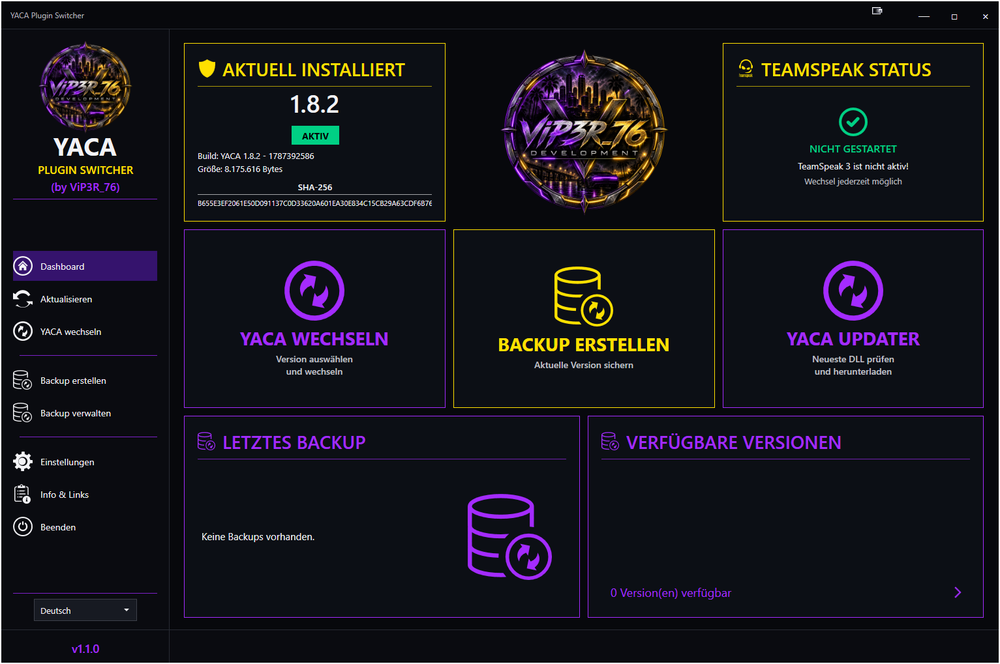

# YACA Plugin Switcher

Leichte Windows-Anwendung zum **Erkennen, Prüfen, Sichern und Wechseln** verschiedener YACA-TeamSpeak-3-Plugin-Versionen.

## Aktuelle Version

**Version 1.1.0** — Windows x64, .NET 10, Self-Contained.

[Neueste Version herunterladen](https://github.com/ViP3R76/Yaca-Plugin-Switcher/releases/latest)

## Screenshot

## Funktionen

- Automatische Erkennung von YACA-DLLs im lokalen `Plugins`-Ordner
- Erkennung von **Version und Build** direkt aus der DLL
- Prüfung auf Windows PE/x64 sowie YACA-spezifische Signaturen ohne Laden der DLL
- SHA-256-Integritätsprüfung
- Sicheres Wechseln zwischen YACA-Versionen
- Automatische Sicherung vor dem Wechsel
- Wiederherstellung von Backups mit Integritätsprüfung
- Automatischer Rollback bei fehlgeschlagener Prüfung nach der Installation
- Konfigurierbare Anzahl der Backups
- Optionale gezielte Backup-Löschung über die Experteneinstellungen
- Automatische TeamSpeak-3-Erkennung und konfigurierbare Plugin-Verzeichnisse
- Integrierter Updater für verfügbare YACA-Versionen
- Fortschrittsanzeige für Download, Entpacken, Prüfung, Validierung und Installation
- Deutsch / Englisch mit automatischer Spracherkennung beim ersten Start
- Dunkle WPF-Oberfläche
- Portable Konfiguration, Backups und Logs neben der Anwendung
- Schutz vor mehrfach gestarteten Instanzen und Diagnose-Logging

## Voraussetzungen

- Windows 10/11 x64
- TeamSpeak 3 Client
- Eine gültige YACA Windows-x64-Plugin-DLL

Die Release-Version ist **Self-Contained**. Eine separate .NET-Runtime muss nicht installiert werden.

## Installation

1. Aktuelle Release-ZIP herunterladen.
2. ZIP in einen beliebigen Ordner entpacken.
3. `YacaPluginSwitcher.exe` starten.
4. Eigene, lizenzierte YACA Windows-x64-DLLs in den lokalen `Plugins`-Ordner legen.
5. YACA-Version über die Anwendung prüfen und verwalten.

**YACA-Binaries und TeamSpeak-Software werden nicht mit diesem Projekt ausgeliefert.**

## Wechseln & Backups

Vor jedem Wechsel wird die ausgewählte DLL erneut validiert. Bei aktivierten automatischen Backups wird das aktuell installierte Plugin vor dem Austausch gesichert.

Die neue DLL wird zunächst über einen temporären Pfad verarbeitet, geprüft und anschließend als `yaca_win64.dll` installiert.

Schlägt die Prüfung nach der Installation fehl, kann das zuvor erstellte Backup automatisch wiederhergestellt werden.

Standardmäßig werden **4 Backups** behalten. Die Anzahl kann zwischen 1 und 9 eingestellt werden.

## Updater

Der integrierte Updater kann verfügbare YACA-Versionen erkennen und ausgewählte Versionen in den lokalen Anwendungsspeicher herunterladen.

Der Ablauf umfasst:

1. Download
2. Entpacken
3. Verifizierung
4. Validierung
5. Installation
6. Aufräumen / Beibehalten des Downloads
7. Abschluss

## Konfiguration & Logs

Die Anwendung arbeitet portabel. Konfiguration, Backups und Logs werden direkt neben der Anwendung gespeichert.

Einstellbar sind unter anderem Sprache, TeamSpeak-3-Plugin-Verzeichnisse, automatische Backups, Backup-Aufbewahrung, TeamSpeak-Warnungen, Updater-Verhalten und Experteneinstellungen.

Logs befinden sich unter `Logs\YacaPluginSwitcher-YYYY-MM-DD.log`. Die Log-Aufbewahrung ist auf drei Tage begrenzt.

## Drittanbieter

YACA und TeamSpeak 3 sind Produkte von Drittanbietern. Dieses Projekt ist unabhängig und liefert deren Software nicht mit aus.

- YACA Systems: https://yaca.systems/
- TeamSpeak: https://www.teamspeak.com/

## Rechtlicher Hinweis

YACA Plugin Switcher ist eine unabhängige Drittanbieter-Anwendung von **ViP3R_76**. Es besteht keine Verbindung zu, Unterstützung durch oder offizielle Zusammenarbeit mit **YACA Systems oder TeamSpeak Systems GmbH**.

**YACA, YACA Systems und TeamSpeak / TeamSpeak 3** sind Marken bzw. Eigentum ihrer jeweiligen Rechteinhaber. Die MIT-Lizenz dieses Repositorys gilt ausschließlich für den Quellcode des YACA Plugin Switchers.

## Community

**Autor:** ViP3R_76  
**Discord:** https://discord.gg/9AxuZkyU7P

## Lizenz

Der Quellcode des YACA Plugin Switchers steht unter der MIT-Lizenz. Siehe `LICENSE`.
